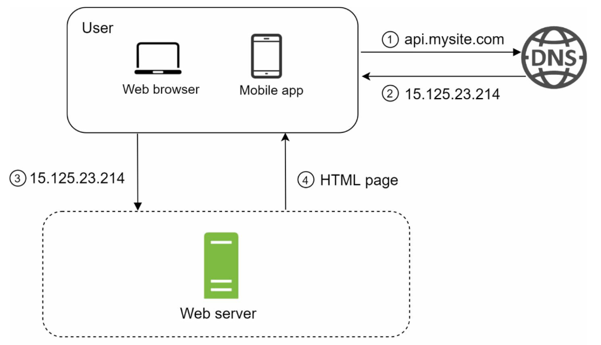
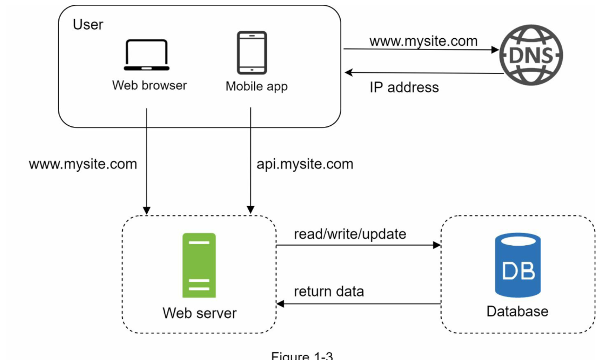

# SYSTEM DESIGN

## Single server



* ```DNS```: Domain Name System, associate the domain name to their IP address.
* ```HTTP``` requests are only sent after the IP address is obtained.

## Multiple Server



When using a DB (Database), we usually use **two server**, one for the **DB** and other one as the **web server**. We do so in order to **scale them independently**.

### Vertical scaling VS Horizontal scaling

* ```Vertical scaling``` (scale-up): adding more power to our server (CPU, RAM, ...).
    * good for low scalability.
    * impossible to add unlimited CPUs.
    * no failover or redudancy, if the server goes down, everything goes down.
* ```Horizontal scaling``` (scale-out): adding more servers to our pool of resources.
    * better for high scalability.

In the previous designs, the users are connected to the web server directly. If the server is offline or if there is too many people connected. Users will experience high latency or shutdown. To solve these problems we use a **load balancer**.
